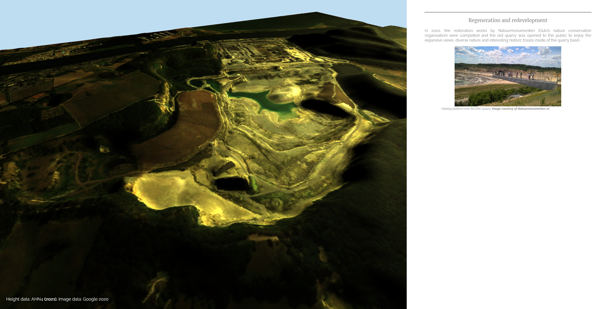
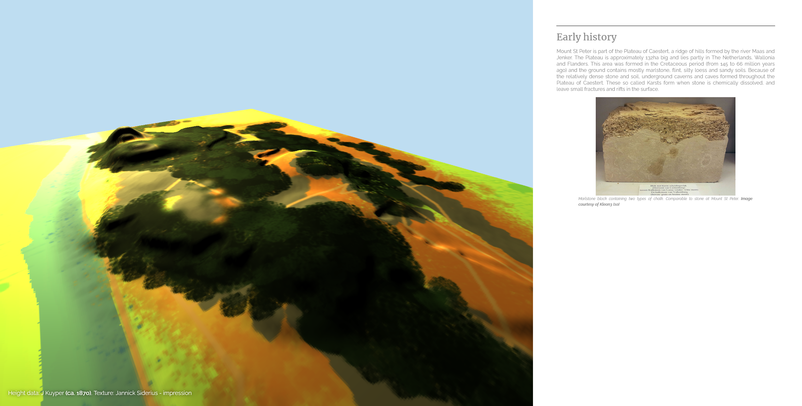
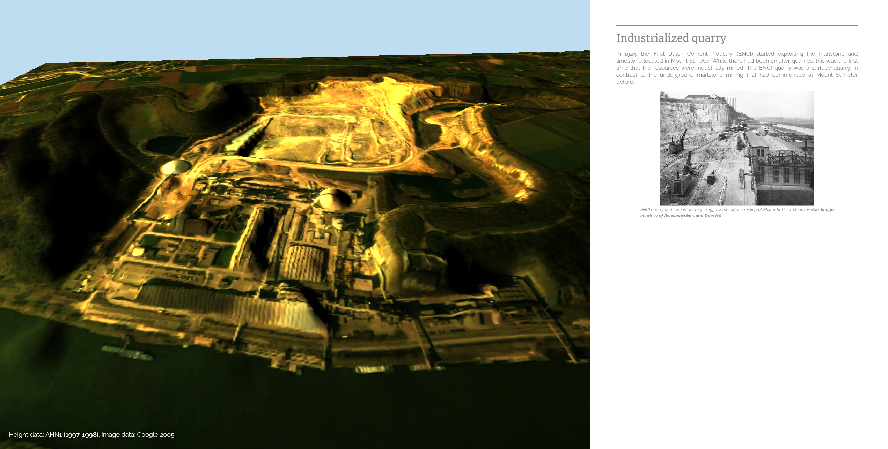

# Mount St Peter
Assignment for HTHT GIS Minor at the University of Twente (September 2022).

### Result
Visualisation of the development and mining of Mount St Peter in Maastricht, Limburg. 
The mount is visualised at different times in history. The 3D models are made in QGIS and Photoshop.
The visualisations are displayed on a website that is built using plain HTML/CSS/JS.
The 3D models are rendered using the THREE.JS framework. Information is displayed in blocks, divided by scrolling sections.

  
   
  

### Tools
- [QGIS 3.22](https://qgis.org/en/site/)
- [Adobe Photoshop 2022](https://www.adobe.com/nl/products/photoshop.html)
- [Three JS r144](https://threejs.org/)
- [VS Code 1.71](https://code.visualstudio.com/)
